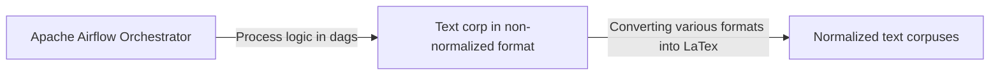

# Welcome to the text corpus processing solution
This solution is aimed to set up an environment for text corpuses crawling and normalizing into latex or any other markup language

> **Note:** At the moment the solution is being developed. Any contributions are welcome

## Current state

Right now the solution consists of two scripts - proxies crawler and arXiv publications crawler. 

# Markdown extensions

StackEdit extends the standard Markdown syntax by adding extra **Markdown extensions**, providing you with some nice features.

> **ProTip:** You can disable any **Markdown extension** in the **File properties** dialog.

# Proposed ecosystem design
Finally, the solution should consis of Apache Airflow dags. The landscape is depicted below:

# ToDos
1. Add proxies support (fully tested)
2. Add centralized config
3. Convert workflows in Airflow dags with adding documentation
4. Add other sources