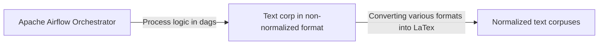

# Welcome to the text corpus processing solution
This solution is aimed to set up an environment for text corpuses crawling and normalizing into latex or any other markup language

> **Note:** At the moment the solution is being developed. Any contributions are welcome

## Current state

Current scripts are able to actualize proxies list, download list of pdf urls and pdf itself

# Proposed ecosystem design
Finally, the solution should consis of Apache Airflow dags. The landscape is depicted below:

# ToDos
0. Convert downloaded pdfs to latex
1. Add centralized config
2. Convert workflows in Airflow dags with adding documentation
3. Add other sources