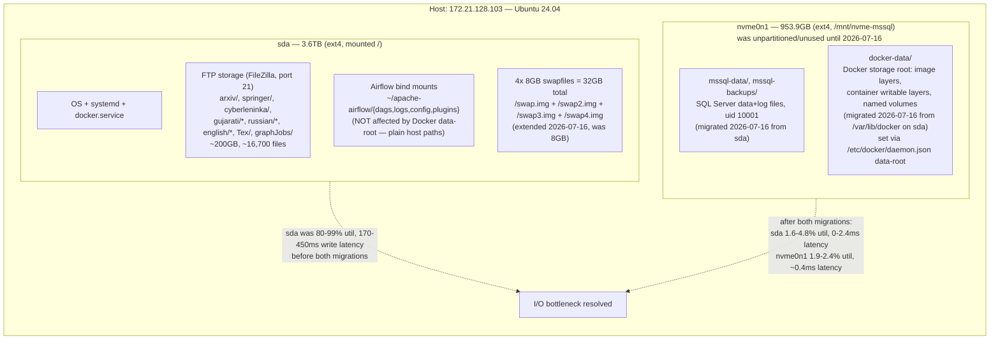
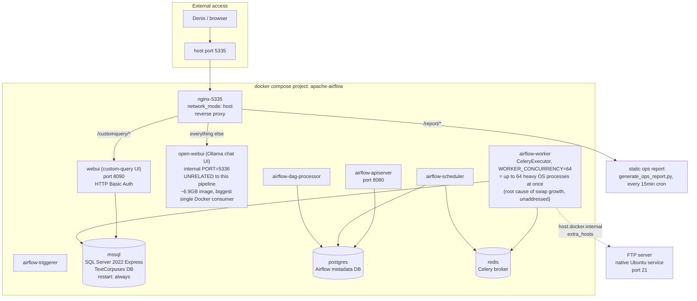
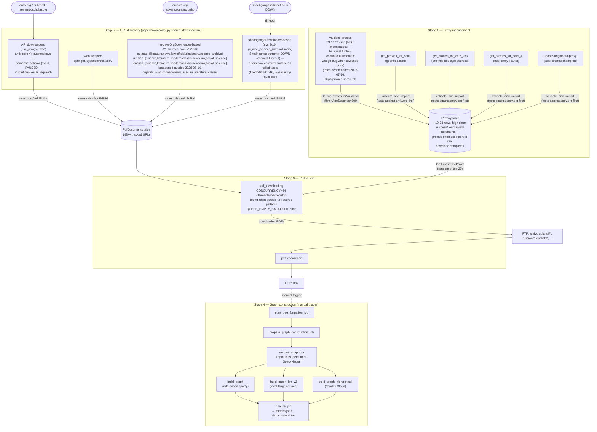
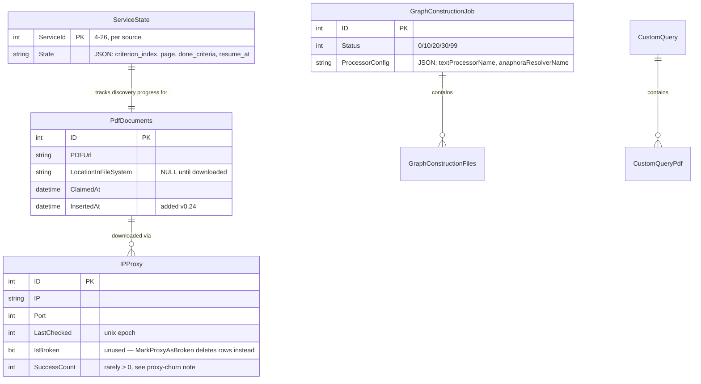
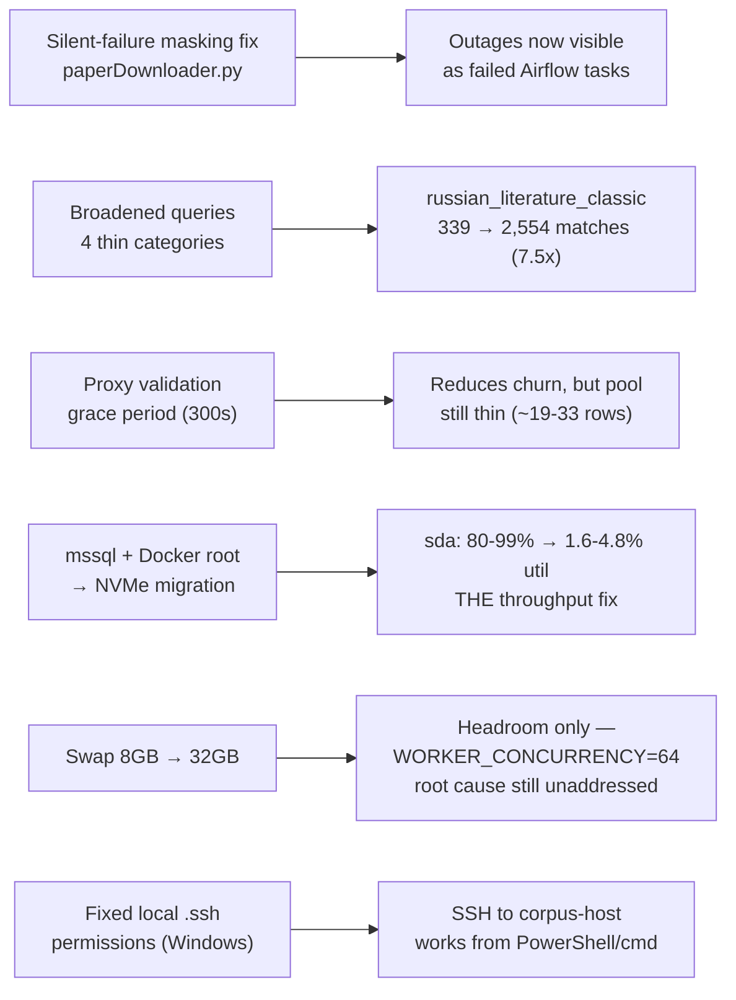

# System Landscape — Text Corpuses Processing Pipeline

Full picture of the production deployment as of 2026-07-16: host/disk layout,
Docker topology, the 4-stage Airflow DAG pipeline, external data sources, the
proxy pool, and storage layout. Diagrams render natively on GitHub (Mermaid).

**Critical reminder:** the git repository (`~/Repositories/text-corpuses-processing/`
on the host) is *not* the deployment. The real, live stack runs from
`~/apache-airflow/` (hand-maintained, not a git repo) — DAG file changes must be
`docker cp`'d into the running containers to take effect. See `CLAUDE.md` /
project memory for the full deployment-topology gotcha.

---

## 1. Host & disk layout (172.21.128.103, `corpus-host`, 24 cores / 31GiB RAM)

---

## 2. Docker Compose topology (`~/apache-airflow/docker-compose.yaml`, CeleryExecutor)

---

## 3. Airflow DAG pipeline — 4 stages, ~35 DAGs

---

## 4. Database — key tables (SQL Server, `TextCorpuses`, now on NVMe)

---

## 5. This session's changes (2026-07-15/16), at a glance

**Known unresolved items:**
- `AIRFLOW__CELERY__WORKER_CONCURRENCY=64` spawns too many heavy Celery worker
  processes for ~30 `@continuous` DAGs — the real driver of swap growth over
  time. Enlarging swap treats the symptom; reducing this or adding
  `worker_max_tasks_per_child` would address the cause.
- Proxy pool remains thin and high-churn even after the grace-period fix —
  free proxies are inherently short-lived; `SuccessCount` still rarely
  accumulates before a proxy dies.
- Shodhganga (`shodhganga.inflibnet.ac.in`) is down for an unknown duration —
  external, not fixable from our side. `gujarati_science_natural/social` will
  resume once it's back, now visibly (not silently) failing in the meantime.
- FTP storage and swap files remain on `sda` — candidates for further NVMe
  migration if disk pressure returns.
